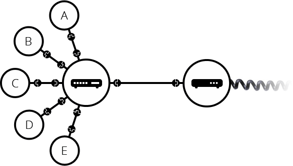
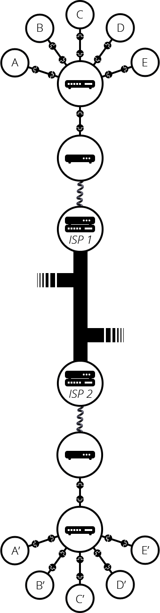

- - -

### Core Terminology:

##### General Concepts:
* **Network** - a connection of devices exchanging data.
	* **LAN (Local Area Network)** - a network that connects devices within a small geographic area, such as a home, office, or campus.
		* 
	* **WAN (Wide Area Network)** - a network that connects devices or LANs across large geographic areas, such as cities, countries, or even continents.
		* 
* **Centralized Network** - a network reliant on a single  central point, vulnerable to failures.
* **Distributed Network** - a network with decentralized nodes, providing greater resilience and fault tolerance.
* **Internet** - a worldwide network connecting billions of devices, allowing them to share information and access resources through protocols like TCP/IP.
* **Protocol** - a set of rules for formatting, transmitting, and processing data between devices.

##### Infrastructure and Components:
* **Neighborhood Network** - local cabling and distribution systems that aggregate data from homes and forwards it to the ISP's main infrastructure.
* **Trunk Line** - high-capacity cables transmitting aggregated data from neighborhoods to the ISP's Central Office.
* **Central Office** - a facility where an ISP manages neighborhood-level connections, aggregates traffic, and routes it to regional or global networks.
* **ISP (Internet Service Provider)** - organizations providing internet access by connecting users  to the global internet.
* **IXP (Internet Exchange Point)** - physical locations where different networks (e.g., ISPs) interconnect to exchange traffic directly, improving speed and reducing latency.
* **Data Centers** - large facilities equipped with servers, storage, and networking systems that store, process, and deliver data such as websites, apps, and cloud services.
	* **TIER Certification**:
		* **Tier 1**: Basic infrastructure with no redundancy, offering 99.671% uptime (~28.8 hours downtime per year).
		* **Tier 2**: Partial redundancy for critical components, offering 99.741% uptime (~22 hours downtime per year).
		* **Tier 3**: Fully redundant systems and dual power supplies, offering 99.982% uptime (~1.6 hours downtime per year).
		* **Tier 4**: Fault-tolerant design, ensuring 99.995% uptime (~26 minutes downtime per year).
	* **Protection and Environment**:
		* Equipped with physical and cybersecurity systems and specialized cooling (e.g., HVAC, liquid cooling) to maintain optimal temperatures (18–27°C/64–81°F).
* **Internet Backbone** - the internet's core, made of high-speed fiber optic cables connecting ISPs and data centers.
* **Submarine Cables** - fiber optic cables on the ocean floor that transmit data between continents, forming a critical part of the global internet backbone.

##### Topologies:

- **Topology** - the arrangement and relationship of elements in a system, particularly in networking, defining how devices are connected and data flows between them.
    - **Physical Topology** - the actual physical layout of devices, cables, and connections in a network.
    - **Logical Topology** - the conceptual arrangement of data flow and communication paths, independent of physical layout.
- **Point-to-Point Topology** - a direct connection between two devices, allowing exclusive communication.
- **Tree Topology** - a hierarchical network combining bus and star layouts.
- **Star Topology** - a network design where all devices connect to a central hub or switch.
- **Bus Topology** - a network configuration where all devices share a single central cable for communication.
- **Hybrid Topology** - a mix of two or more different network topologies to meet specific needs.
- **Ring Topology** - a network setup where devices are connected in a closed loop, and data travels in one or both directions.
- **Mesh Topology** - a network where devices are interconnected, providing multiple pathways for data, enhancing fault tolerance.

##### Devices:
* **Router** - a device that directs data packets between networks, connecting local devices (e.g., phones, laptops) to the internet or other local networks.
* **Modem** - a device that converts digital data from a router into a format suitable for transmission through the ISP's infrastructure, such as light signals for fiber or analog signals for DSL.
* **Access Point** - enable wireless devices to connect to a wired network withing a LAN.
* **Network Interface Card (NIC)** - hardware that allows devices to connect to networks.
* **Host** - a device on a network with an IP address that sends, receives, or processes data for end-user applications (e.g., computers, servers, smartphones).
* **Node** - a device in a network that facilitates communication. Hosts are nodes, but routers or switches are nodes without being hosts.
* **Server** - a computer or device that provides resources, data, services, or programs to other devices, called clients, over a network.

##### Data and Communication:
* **Encapsulation** - the process of wrapping data with headers at each layer of the protocol stack to prepare it for transmission over a network.
* **Decapsulation** - the process of removing headers and footers from data packets at the receiving device to reconstruct the original data.
* **Packet Switching** - a method of transmitting data by breaking it into packets that travel independently.
* **Packets** - the basic unit of data transmission, containing a **header** (source/destination length, error detection) and payload (actual data). Lost packets are re-transmitted by the sender.
* **Headers** - metadata added to the beginning of data packets, including information like source and destination addresses, protocol type, and packet size.
* **Bits** - the smallest unit of data in computing, represented as either a 0 or 1, forming the foundation of digital communication.
* **Protocol Stack** - layers of protocols (e.g., TCP/IP) managing data transmission.
* **Bandwidth** - the maximum amount of data that can be transmitted over a network in a given amount of time, typically measured in **bps** (bits per second) or its multiples like Mbps/Gbps.
- **Bitrate** - the actual amount of data being transferred per second, measured in **bps**. It can vary within the bandwidth limits depending on the load and transmission quality.
- **Latency** - the delay or time taken for data to travel from the sender to the receiver, usually measured in **milliseconds (ms)**.
- **Throughput** - the actual amount of data successfully delivered over a network in a specific period, factoring in congestion, errors, and retransmissions.
- **Goodput** - the measure of application-level throughput, reflecting only useful data (not including protocol overhead or retransmitted data).

##### Addresses and Identifiers:
* **IP Address** - a unique numerical identifier assigned to every device on a network, used for addressing and routing data (e.g., `192.168.1.1`).
* **Port Numbers** - numerical identifiers used to specify particular services or applications on a device (e.g, port 80 for HTTP or port 443 for HTTPS).
* **Sequence Number** - a number assigned to each data packet in TCP to ensure packets are reassembled in the correct order at the destination.
* **DNS (Domain Name System**) - a system that translates human-readable domain names (e.g, `example.com`) into IP addresses required for device communication.

##### Key Protocols:
* **IP (Internet Protocol)** - a protocol that defines how data packets are addressed and routed between  devices across a network:
	* **IPv4**:
		* Contains **32 bits**, divided into **4 octets** (e.g., `192.168.1.1`).
		* Supports approximately **4.3 billion unique addresses** (2³²).
		* Uses a **subnet mask** (e.g., `255.255.255.0`) to separate the network and host parts of an IP address (e.g., `/24` defines 24 bits for the network).
	* **IPv6**:
		* Contains **128 bits**, divided into **8 segments** (e.g., `2001:0db8:85a3:0000:0000:8a2e:0370:7334`).
		* Supports approximately **340 undecillion addresses** (2¹²⁸), solving IPv4 exhaustion.
		* Uses a more advanced system for **addressing and routing**, with a subnet mask often represented as a **prefix length** (e.g., `/64`).
* **TCP (Transmission Control Protocol)** - a protocol that ensures data packets are delivered accurately, in the correct order, and without errors.
* **UDP (User Datagram Protocol)** - a faster but less reliable alternative to TCP, used in video streaming and online gaming.
- **FTP (File Transfer Protocol)** - a protocol for transferring files between devices, commonly replaced by modern alternatives like SFTP.
* **TCP/IP** - a suite combining TCP and IP protocol,s forming the foundation for internet communication by managing data routing and delivery. It also refers to the **TCP/IP model**, a conceptual framework with **four layers** (Application, Transport, Internet, and Network Access) that represents how data flows across interconnected networks.
* **HTTP (HyperText Transfer Protocol)** - a protocol used to transfer web pages and other resources between a browser and a web server.
* **URI (Uniform Resource Identifier)** - a standardized address used to identify and access resources on the web, such as web pages or files.

##### Technology Types:
- **Cable Internet**: Uses coaxial cables, speeds between 100 Mbps–1 Gbps.
- **Fiber Optics**: Transmits data as light through fibers, speeds up to 10 Gbps, low latency.
- **DSL**: Uses copper phone lines, speeds 1–100 Mbps, performance degrades with distance.
- **Wireless Access**: Includes 4G LTE (up to 100 Mbps) and 5G (up to 10 Gbps), ideal for mobile and remote use.
- **4G LTE**: Fast mobile internet for streaming and browsing.
- **5G**: Ultra-fast, low-latency technology for high-demand scenarios.

##### Historical Innovations and Key Milestones:
* **ARPANET (Advanced Research Project Agency Network)** - the first decentralized communication network, developed in the 1960s, by ARPA to ensure resilience during potential attacks.
* **WWW (World Wide Web)** - a system of interlinked web pages, allowing users to navigate the internet through hyperlinks.
* **HyperText** - text containing links to others resources or documents, allowing users to navigate intuitively by clicking on links.
* **HTML (HyperText Markup Language)** - a standard language used to create and format web pages with elements like text, images, links, etc.

- - -

### When and why was invented the Internet?

##### Problem:

After World War II, the Cold War broke out between the United States and the Soviet Union. 

On October 4, 1957, the Soviet Union launched the Earth's first artificial satellite, Sputnik-1.
The successful launch shocked experts and citizens in the United States, sparking fears about the Soviet Union's technological edge.

At that time, the United States relied on a **centralized telephone network** for communication. This design was a major vulnerability: a single nuclear strike on the main node could disrupt communications across the entire country.

The risk of nuclear war created an urgent need for a communication system that could survive such attacks and still function.

##### Idea:

In response to these vulnerabilities, the **Advanced Research Projects Agency (ARPA)** was established on February 7, 1958.

Its primary goal was to build a decentralized communication network that could withstand attacks and keep working no matter what.

The idea was based on two simple but revolutionary principles:
1. **Data Transmission in Bits**:
	* All information - text, images, videos, or even voice - would be broken down into binary bits (1s and 0s). Computers would handle these bits, process them, and turn them back into human-readable formats.
2. **Decentralization**:
	* The network needed to avoid central points of failure. It had to be **distributed**, with every node equally important and connected to others. If one node went down, the other would still function.

Another key innovation was breaking data into **packets** - smaller, manageable chunks. Each packet could take its own route to the destination, where they'd be reassembled into the original message. This approach made data transmission more efficient and resilient.

##### Implementation:

ARPA brought in some of the brightest minds from universities to implement this idea. The task was given to:
* The University of California, Santa Barbara
* Stanford University
* The University of Utah

Key milestones in the early days of **ARPANET**:
* **October 20, 1969**: The first message was sent between two computers 640 kilometers apart. The message was supposed to be "login", but the system crashed after sending just "lo". 
* **December 5, 1969**: They finally managed to send complete messages without crashes.
* **1971**: ARPANET grew to 15 nodes, and the first-ever **email** was sent.
* **1973**: The network went international, connecting to the UK and Norway.
* **1977**: ARPANET now had 111 computers.
* **1983**: Over 4,000 hosts were connected, and undersea cables between the US and Europe enhanced connectivity with European networks.

##### Challenges:

By the 1980s, networks used incompatible protocols, making communication between them impossible. The rise of affordable personal computers increased demand for a standard, universal system to connect networks seamlessly.

##### Key Innovations:

To solve these issues, ARPANET introduced standardized protocols that became the foundation of the modern internet:

1. **IP (Internet Protocol)**:
	* Every device on the network got a unique 32-bit address (e.g., `192.168.1.1`). This made it possible to locate and connect to any device.
2. **TCP (Transmission Control Protocol)**:
	* TCP made sure data packets arrived in the right order and without errors.Combined with IP, this became the TCP/IP protocol suite - the backbone of internet communication.

As the number of devices grew, remembering IP addresses became impractical. Initially, they stored pairs of hostnames and IP addresses in a file called `hosts.txt`, but it didn't scale.

To fix this, they created the **Domain Name System (DNS)**, which translated human-readable domain names (like `example.com`) into IP address. This made it much easier for people to navigate the growing network.

##### Key Contributors to Internet Development:

* **Paul Baran** - proposed a decentralized communication network resilient to potential failures.
* **Leonard Kleinrock** - developed the concept of packet switching, enabling data transmission across networks.
* **Vinton Cerf and Robert Kahn** - created the TCP/IP protocols, forming the foundation of internet communication.
* **Tim Berners-Lee** - invented the World Wide Web, making the internet accessible and user-friendly.

##### Commercialization:

Originally, ARPANET was controlled by DARPA and used for military and research purposes.

But with the rise of personal computers, the US government began shifting control to civilian organizations:
* **1984**: The National Science Foundation Network (**NSFNET**) launched. It was faster than ARPANET and opened to scientists and academics.
* Over time, the government handed control to commercial organizations, leading to the rise of **Internet Service Providers (ISPs)**.

This transition allowed businesses and individuals to access the internet, fueling its growth and adoption worldwide.

##### The Role of Tim Berners-Lee and the WWW:

In the late 1980s, Tim Berners-Lee, an  English computer scientist, introduced the idea of HyperText.

This was a game-changer. HyperText allowed documents to contain links to other resources, making navigation between related content easy and intuitive.

To implement HyperText, Berners-Lee developed three key technologies:
1. **HTML (HyperText Markup Language)**: A markup language for structuring and formatting web content like text, images, and links.
2. **HTTP (HyperText Transfer Protocol)**: A protocol for transferring data between computers, including HTML, images, and other web resources.
3. **URI (Uniform Resource Identifier)**: identifies and accesses web resources using unique addresses.

These technologies came together to create the **World Wide Web (WWW)** in 1991. The WWW transformed the internet from a tool for researchers into a global platform for communication, business, and entertainment. 

##### Conclusion:

The internet started as a response to Cold War fears, but it quickly grew into something much bigger.
From ARPANET to the World Wide Web, it revolutionized how we connect, share information, and work together.

What began as a military experiment is now an essential part of modern life, powering  everything from email to streaming services and enabling global communication on a scale no one could have imagined.

- - -

### The internet consists of three major parts:

##### 1. First and Last Mile.

The **First and Last Mile** present the entry and exit points of data as it moves between users and larger internet infrastructure:
* **First Mile**: The initial journey of data from the core internet (e.g., ISPs, data centers) to local distribution points.
* **Last Mile**: The final stretch where data reaches end-users, such as homes, businesses, or devices like smartphones and routers. 

Key Last Mile Technologies:
* **Cable Internet**:
	* **Technology**: Uses coaxial cables initially installed for cable TV.
	* **Speed**: Provides high-speed internet, typically ranging from 100 Mbps to 1 Gbps.
* **Fiber Optics**: 
	* **Technology**: Uses glass or plastic fibers to transmit data as light signals.
	* **Speed**: Offers unmatched speeds, reaching up to 10 Gbps with minimal latency.
	* **Reliability**: Resistant to interference and capable of handling high-demand use cases like 4K streaming and cloud applications.
* **DSL**: 
	* **Technology**: Transmits data over existing copper telephone lines.
	* **Speed**: Typically slower than coaxial cable or fiber, ranging from 1 Mbps to 100 Mbps.
* **Wireless Access**: 
	* **Technology**: Relies on cellular towers and wireless networks (e.g., 4G LTE, 5G).
	* **Speed**: Varies by technology - 4G LTE offers speeds up to 100 Mbps, while 5G can  exceed 1 Gbps. 

##### 2. Internet Hubs.

These are physical connection points where networks like ISPs, data centers exchange traffic.
* **Purpose**: Efficiently route data, reduce latency, and localize traffic.
* **Examples**: Internet Exchange Points (IXPs) and regional data centers.

**Data Centers**:
* **Role**: Host user data, applications, and content, ensuring fast delivery and redundancy.
* **Ownership**: Can be owned by major tech companies (e.g., Google, Facebook) or independent commercial providers.
* **Strategic Location**: Often placed in areas with affordable land and electricity.

##### 3. Internet Backbone.

The **Internet Backbone** is the core of the internet, consisting of high-capacity fiber optic networks that connect continents, data centers, and regional ISPs.
* **Technology**: Fiber optic cables (terrestrial and undersea).
* **Connectivity**: Backbone providers interconnect at Internet Exchange Points (IXPs) in major cities to optimize routing and reduce costs.

- - -

### How Data Travels Across the Internet:

**Scenario**: Sending a message from a home in Kazakhstan to a friend on another continent.

##### 1. Client Device: Packetization and Encapsulation.

The sender's device (e.g., smartphone or laptop) prepares the message by breaking it into smaller, manageable **packets**.

Each packet is **encapsulated** with protocol-specific headers, including:
* **Source and Destination IP address**: Where the data is coming from and where it's going.
* **Port Numbers**: Indicating the type of service.
* **Sequence Numbers**: To ensure packets are reassembled in the correct order.

The device sends these packets to the **home router/modem** over Wi-Fi or Ethernet.

##### 2. Home Router and Modem.

Star Topology

**Router**:
* The router receives packets from the client device and uses its **routing table** to decide where to send them based on the destination IP address.

**Modem**:
* Converts digital signals from the router into a transmission-friendly format:
	* **Analog signals** for DSL or cable.
	* **Light pulses** for fiber optics.

##### 3. Neighborhood Network and Local ISP.

Tree Topology

The **modem/router** sends data packets to a **local distribution box**, which aggregates traffic from multiple households. This aggregated data travels via a high-capacity **trunk line** to the ISP's **Central Office (CO)**.

At the CO, the ISP determines the best route for the packets using **routing protocols** (e.g., BGP):

- **Internal Routing**: Packets destined for recipients within the same ISP's network are routed to the regional infrastructure.
- **External Routing**: Packets for recipients outside the ISP’s network are forwarded to an **Internet Exchange Point (IXP)** or peering partner.

##### 4. Regional Data Center or Internet Exchange Point (IXP).

Bus Topology

If forwarded to an **IXP**, packets are exchanged with the destination network or a backbone provider.

At this stage, the recipient's ISP or a higher-tier backbone network takes responsibility for delivering the packets.

##### 5. Internet Backbone.

For long-distance communication, packets are routed through the **Internet Backbone**, a global network of high-capacity fiber optic cables.

If the destination is one another continent, packets travel via submarine cables, which carry massive amounts of data across oceans.

Backbone routers direct packets either to the recipient's ISP or the next appropriate network along the transmission path.

##### 6. Recipient's ISP (Regional Infrastructure).

Hybrid Topology

Packets enter the recipient's ISP network via a **regional IXP** or another interconnection point.

The recipient's ISP uses its internal routing to direct packets toward the recipient's neighborhood infrastructure.

##### 7. Final Mile (Last Mile).

Packets travel through the recipient's neighborhood infrastructure (e.g., local distribution boxes and cables) to their home router.

The router delivers packets to the device for **reassembly**.

- - -

### What is the World Wide Web?

The **World Wide Web (WWW)** is a system for publishing and accessing information on the internet, created by **Tim Berners-Lee** at CERN in **1991**. It introduced hyperlinks, enabling seamless navigation between documents, and became the most user-friendly way to interact with the internet.

The web evolved to support **images**, **audio**, **video**, and **interactive content**, enabling applications like Google Docs. In 1994, Tim Berners-Lee founded the **World Wide Web Consortium (W3C)** to establish open web standards. While major browsers influence development, W3C remains the primary authority for standardizing protocols like HTML and CSS.

- - -

### Web Browsers:

A **web browser** is software used to access websites and web applications. The key milestones include:
* **Mosaic (1993)**: The first popular browser, later evolving into Netscape.
* **Internet Explorer (1995)**: Dominated the market in the late 1990s.
* **Safari (2003)**: Apple's browser optimized for macOS and iOS.
* **Firefox (2004)**: Open-source successor to Netscape.
* **Chrome (2008)**: Google's browser, becoming the most used by 2015.

- - -

### Internet Applications:

* **Web Browsers** - programs to access and navigate the World Wide Web (e.g., Chrome, Firefox).
* **Email Clients** - applications for sending and receiving emails (e.g., Outlook, Gmail).
* **File Sharing** - services for transferring files over the internet (e.g., BitTorrent, Google Drive).
* **Instant Messaging** - platforms for real-time text, voice, or video communication (e.g.,  WhatsApp, Zoom)
* **Streaming Platforms** - platforms for audio/video consumption (e.g., Spotify, YouTube).

- - -

### What is cloud?

The cloud refers to a network of remote servers hosted on the internet that store, manage, and process data, instead of using a local server or personal computer.

##### Common Uses:
* Data storage
* Application hosting
* Big data and analytics
* Machine learning and AI
* Collaboration Tools

- - -

### Who runs the internet?

The internet is a decentralized network of networks, meaning **no single entity owns or controls it entirely**.

The main organizations influencing the internet:
* **ICANN (Internet Corporation for Assigned Names and Numbers)** - oversees domain names, IP address allocation, and DNS management.
* **IETF (Internet Engineering Task Force)** - develops and maintains internet protocols like HTTP, TCP/IP, etc.
* **IEEE (Institute of Electrical and Electronics Engineers)** - sets standards for physical networking technologies (e.g., Ethernet, Wi-Fi).
* **W3C (World Wide Web Consortium)** - develops web standards (e.g., HTML5, CSS3).

- - -

# Resources:

* https://roadmap.sh/guides/what-is-internet
* https://www.youtube.com/watch?v=TNQsmPf24go&list=LL&index=6&ab_channel=Vox
* https://cs.fyi/guide/how-does-internet-work
* https://www.vox.com/2014/6/16/18076282/the-internet
* https://www.youtube.com/watch?v=x3c1ih2NJEg&ab_channel=SabinsCivilEngineering
* https://www.youtube.com/watch?v=Sfzo4xm5eX8&list=LL&index=5&ab_channel=BLASTERTECHNOLOGY
* https://developer.mozilla.org/en-US/docs/Learn/Common_questions/Web_mechanics/How_does_the_Internet_work

And huge credit to chatGPT :D