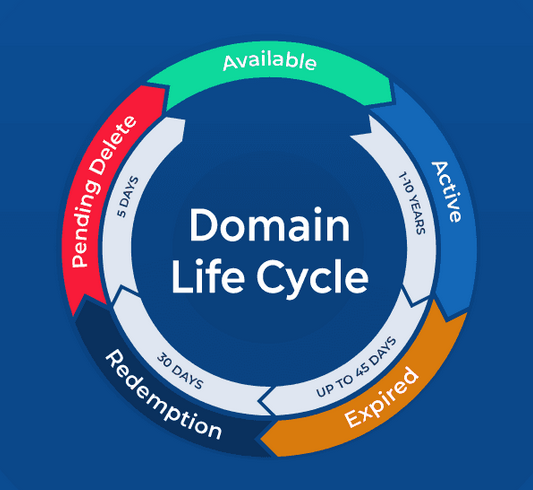
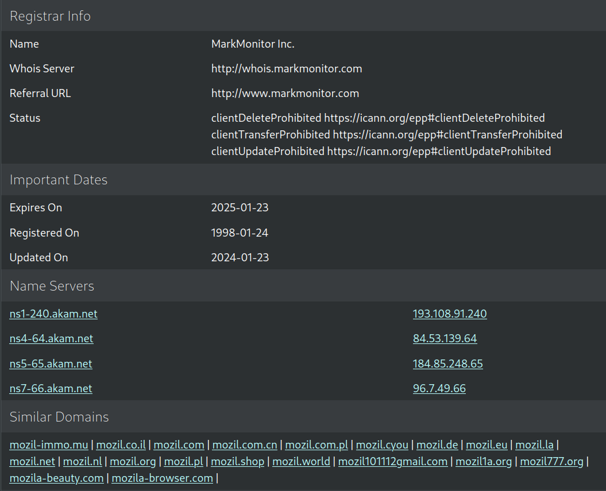
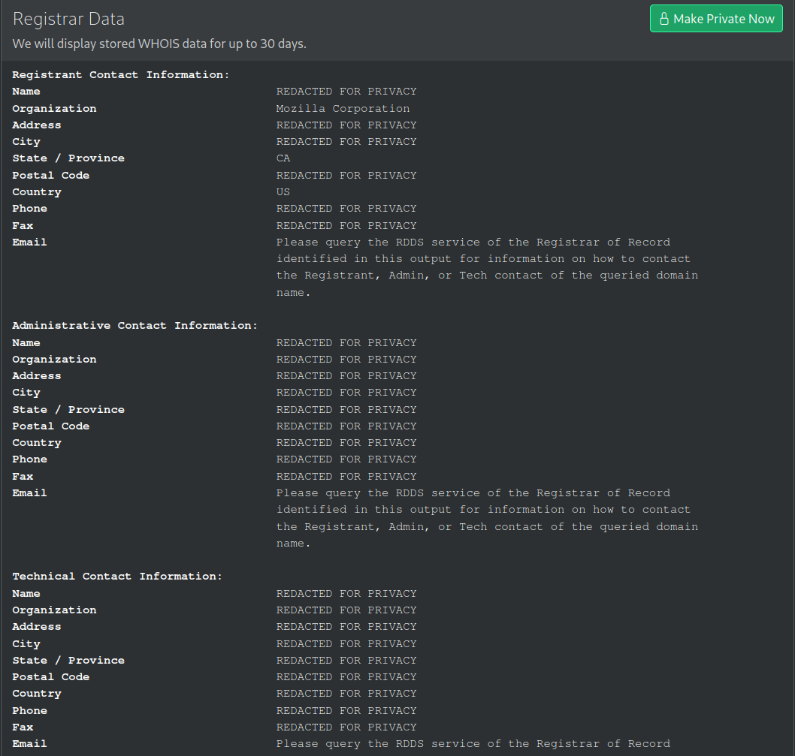
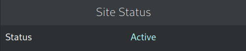
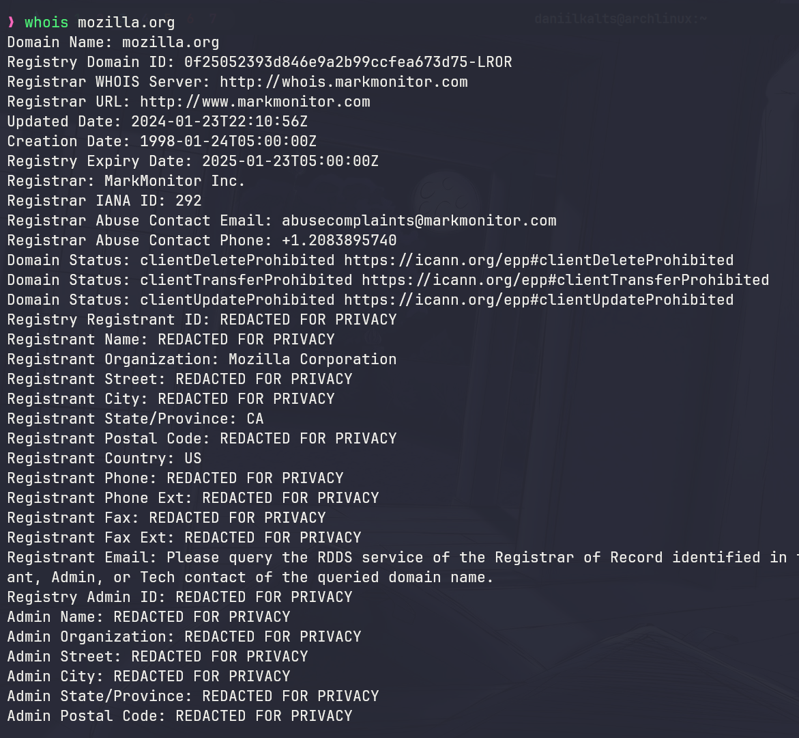
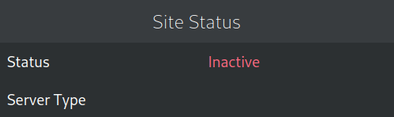
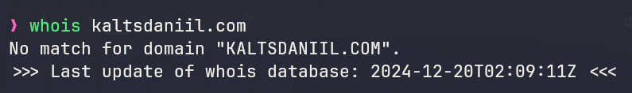

- - -

###### Table of Contents:
1. **[[#Understanding IP Addresses:]]**
	- [[#How IP Address Work:]]
	- [[#Challenges with IP Addresses:]]
	- [[#Domain Names as a Solution:]]
2. **[[#Introduction to Domain Names:]]**
	- [[#Domain Names vs URLs:]]
3. **[[#Anatomy of a Domain Name:]]**
	- [[#Common TLDs:]]
	- [[#Country-Specific TLDs:]]
	- [[#Domain Name Creating Rules:]]
4. **[[#Practical Domain Name Examples:]]**
5. **[[#Internationalized Domain Names (IDNs):|Internationalized Domain Names (IDNs):]]**
	- [[#Examples of IDNs:]]
6. **[[#The Lifecycle of a Domain Name:]]**
7. **[[#How to get a Domain Name:]]**
	- [[#Understanding Domain Ownership:]]
	- [[#Finding Available Domains:]]
	- [[#Steps to Register a Domain:]]
8. **[[#Resources and References:]]**

- - -

 

### Understanding IP Addresses:

> [!NOTE] IP (Internet Protocol) Address
> A unique numerical identifier assigned to devices and services on a network, enabling communication, data transfer, and access to resources.

 

##### How IP Address Work:
Every device connected to the internet - like computers, phones, or servers - has an **IP Address**. This unique sequence of numbers, such as `192.158.1.38`, identifies devices and resources on a network, ensuring data is sent to the correct destination.

Without IP addresses, it would be impossible to locate sender and receiver devices, or access services and resources hosted on those devices.

##### Challenges with IP Addresses:
While IP addresses work well for devices, they are difficult for humans to remember, especially when accessing web resources like websites or services. For example:
- Memorizing `172.217.14.206` is far harder than typing `google.com`.

##### Domain Names as a Solution:
To make it easier for humans to access web resources, **domain names** were introduced. They serve as human-readable labels that map to IP addresses, providing easy-to-remember alternatives for accessing internet resources like websites, APIs, and downloadable files.

- - -

 

### Introduction to Domain Names:

> [!NOTE] Domain Name
> A **Human-readable address** that map to an **IP** address.

 

Think of it as a contact list that represents pairs of names and phone numbers, or a map showing buildings and their addresses.

When you access a resource on the internet, your local computer sends a request to **DNS (Domain Name System)**.

> [!NOTE] DNS (Domain Name System)
> This is a remote server that stores pairs of **Domains** and corresponding **IP** addresses.

 

**DNS** is like a translator between humans and machines.

##### Domain Names vs URLs:

> [!NOTE] URL (Uniform Resource Locator)
> A **complete address** that specifies the location of a resource on the web, including the protocol, domain name, and optional path or query parameters.

 

A **domain name** is part of a **URL** but not the entire address. While you can access a web resource by entering just the domain name, it points to the homepage or default location of the website. A URL provides a more specific address, leading directly to a particular resource.

##### For example:
- **Domain Name**: `example.com`
    - This will take you to the main page (homepage) of the website.
- **URL**: `https://example.com/blog/how-to-learn`
    - This full address takes you directly to a specific article on the website, such as a blog post titled "How to Learn."

- - -

 

### Anatomy of a Domain Name:

> [!NOTE] Subdomain
> This is **the starting portion** of a Domain Name, used to host multiple services or sections under a single domain name.

👇

> [!NOTE] SLD (Second-Level Domain)
> This is **the middle portion** of a Domain Name,  representing  the brand, organization, or  purpose of the website.

👇

> [!NOTE] TLD (Top Level Domain)
> This is **the ending portion** of a domain name, indicating the website's mission.

👇

> [!NOTE] Root Domain
> This is **the unique identifier** formed by combining the **SLD** and **TLD**, without subdomains.

👇

> [!NOTE] FQDN (Fully Qualified Domain Name)
> This is **the complete address** formed by combining **subdomain** (if any), **SLD**, **TLD**.

 

##### Common TLDs:
- **.com** - **Commercial**. Originally intended for commercial businesses but nowadays used by all types of entities, including personal websites.
	- *For instance*: `amazon.com`, `google.com`.
- **.org** - **Organization**. Initially designed for nonprofit organizations, but now open for general use. It's frequently associated with nonprofits, charities, and educational institutions. 
	- *For instance*: `wikipedia.org`, `unicef.org`.
- **.net** - **Network**. Originally intended for internet service providers (ISPs) or network-related services, but now widely used for general purposes. Often adopted by technology companies and infrastructure-related services.
	- *For instance*: `speedtest.net`, `slideshare.net`.
- **.edu** - **Education**. Reserved for accredited educational institutions, primarily in the  United States. Used by schools, universities, and other educational organizations.
	- *For instance*: `harvard.edu`, `mit.edu`.
- **.gov** - **Government**. Restricted to U.S government entities.
	 - *For instance*: `usa.gov`, `nasa.gov`.
- **.io** - **Indian Ocean**. Originally intended for the  British Indian Ocean Territory but now popular among tech startups. Often associated with technology, innovation, and developer platforms.
	- *For instance*: `github.io`, `trello.io`.

 

> [!info] How TLDs are Created?
> **Internet Corporation for Assigned Names and Numbers (ICANN)** approves and manages TLDs through an application process.

 

##### Country-Specific TLDs:
- *.cn* - China
- *.de* - Germany
- *.uk* - United Kingdom
- *.ru* - Russia
- *.br* - Brazil
- *.au* - Australia
- *.jp* - Japan
- *.fr* - France

##### Domain Name Creating Rules:
- **Length**: Must be 1–63 characters per segment and no more than 253 characters in total.
- **Characters**: Use only letters (`a-z`), numbers (`0-9`), and hyphens (`-`).
- **Hyphen Restrictions**: Cannot begin or end with a hyphen, and no consecutive hyphens (`--`).
- **Case Insensitivity**: Domains are not case-sensitive (`Example.com` = `example.com`).
- **IDN Support**: Non-Latin characters are allowed via IDN (e.g., `пример.рф`).
- **TLD**: Must include a valid Top-Level Domain (e.g., `.com`, `.org`, `.ru`).

- - -

 

### Practical Domain Name Examples:

- Google Website:
	- **FQDN**: `www.google.com`
		- Subdomain: *www*
		- SLD: *google*
		- TLD: ***.com***
		- Root Domain: *google.com*
	- **IP Address**: `142.250.190.78`
- Wikipedia Website:
	- **FQDN**: `en.wikipedia.org`
		- Subdomain: *en*
		- SLD: *wikipedia*
		- TLD: ***.org***
		- Root Domain: *wikipedia.org*
	- **IP Addresses**: `208.80.154.224`

 

> [!info] Remember!
> The last segment of a domain name is always **TLD**. The segment immediately before the TLD is the **SLD**. Any segments preceding the SLD are **subdomains**.

 

There are **exceptions**, such as **Country-Code TLDs (ccTLDs)**, which may include additional levels (e.g., `.co.uk`), but these are less common.

- - -

 

### Internationalized Domain Names (IDNs):

Internationalized Domain Names (IDNs) support non-English scripts, allowing domain names in languages like Russian, Georgian, etc.

##### Examples of IDNs:
- `http://россия.рф/`
	- Subdomain: none
	- SLD: *россия*
	- TLD: *.рф*
	- Root Domain: *россия.рф*
- `http://президент.рф/`
	- Subdomain: none
	- SLD: *президент*
	- TLD: *.рф*
	- Root Domain: *президент.рф*
- `http://თბილისი.გე/`
	- Subdomain: none
	- SLD: *_თბილისი_*
	- TLD: *.გე*
	- Root Domain: *თბილისი.გე*

- - -

 

### The Lifecycle of a Domain Name:

Domains must be renewed periodically. Otherwise, they may expire and go through phases:
- **Grace Period (0–45 days)**: The domain is inactive but can be renewed without extra fees.
- **Redemption Period (30 days)**: Recovery is possible but incurs a penalty fee.
- **Pending Deletion (5–7 days)**: The domain cannot be recovered and awaits deletion.
- **Deletion**: The domain is released for re-registration

 

- - -

 

### How to get a Domain Name:

##### Understanding Domain Ownership:

**You cannot "buy a domain name"**. This ensures unused and abandoned domain names become available for others to use. If every domain name was bought, the web would quickly fill up with unused domain names that were locked and couldn't be used by anyone.

**Instead, you pay for the right to use a domain name for one or more years**. You can renew your right, and your renewal has priority over other people's applications. But you never own the domain name.

Companies called **registrars** use domain name registries to keep track of technical and administrative information connecting you to your domain name.

##### Finding Available Domains:

Let's say we need to figure out if `mozilla.org` exists.

**There are two available options:**
1. Visit a "`who.is`" website and enter a domain name.
	- 
	*  
	* 
2. Use a system with a built-in  shell, type a whois command followed by domain name.
	* 

As you can see, we can't register `mozilla.org` because the Mozilla Foundation has already registered it.

Now let's see if we could register `kaltsdaniil.com`.

1. Visit a "`who.is`" website and enter a domain name.
	* 
2. Use a system with a built-in shell, type a whois command followed by domain name.
	* 
 

As we can see, the domain does not exist in the whois database, so we could ask to register it.

##### Steps to Register a Domain:
1. Go to a registrar's website.
2. Usually there is a prominent "Get a domain name" call to action. Click on it.
3. Fill out the form with all required details. Make sure, that you have not misspelled your desired domain name. Once it's paid for, it's too late!
4. The registrar will let you know when the domain name is properly registered. Within a few hours, all DNS servers will have received your DNS information.

- - -

 

# Resources and References:
* https://roadmap.sh/backend
* https://www.youtube.com/watch?v=Y4cRx19nhJk&ab_channel=CreateaProWebsite
* https://www.youtube.com/watch?v=qO5qcQgiNX4&ab_channel=ElegantThemes
* https://www.cloudflare.com/en-gb/learning/dns/glossary/what-is-a-domain-name/
* https://developer.mozilla.org/en-US/docs/Learn/Common_questions/Web_mechanics/What_is_a_domain_name

And huge credit to chatGPT :D